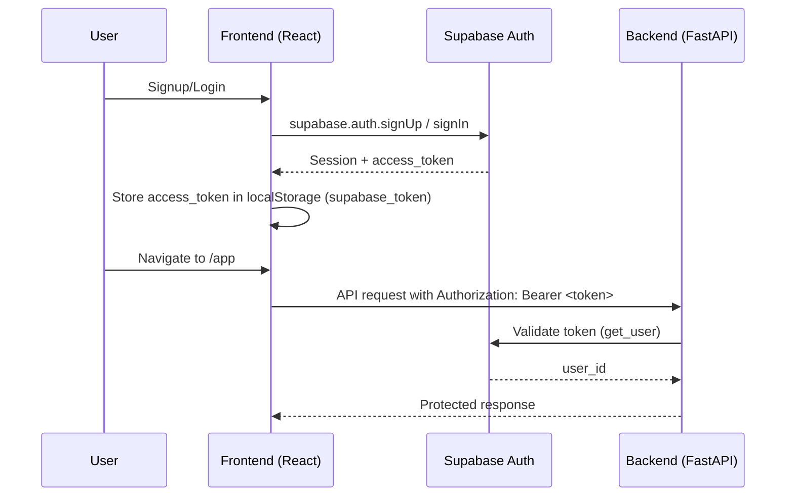
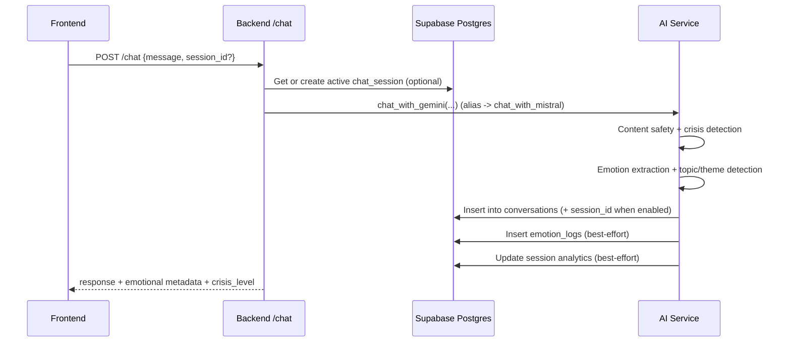
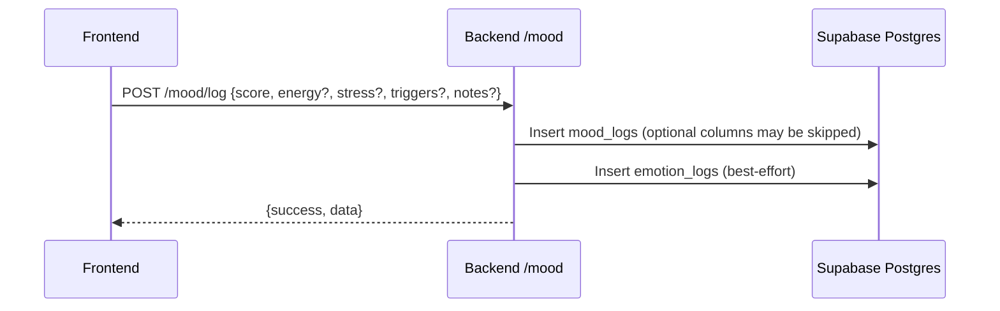
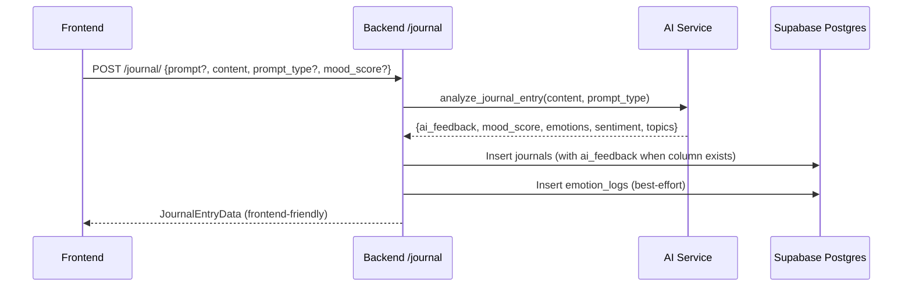
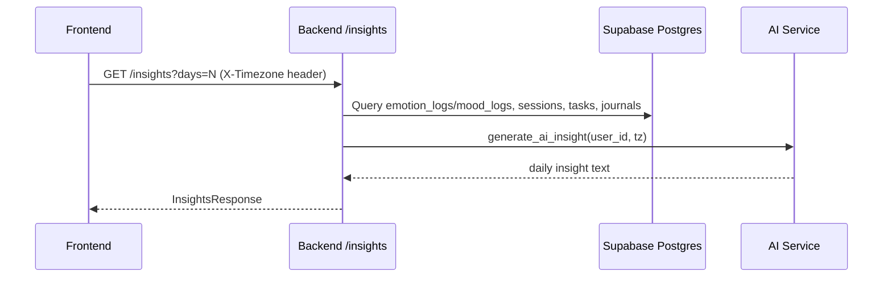
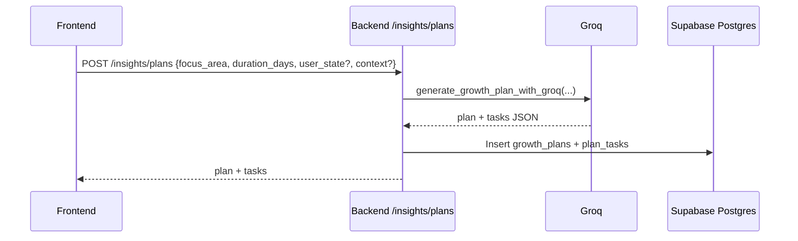
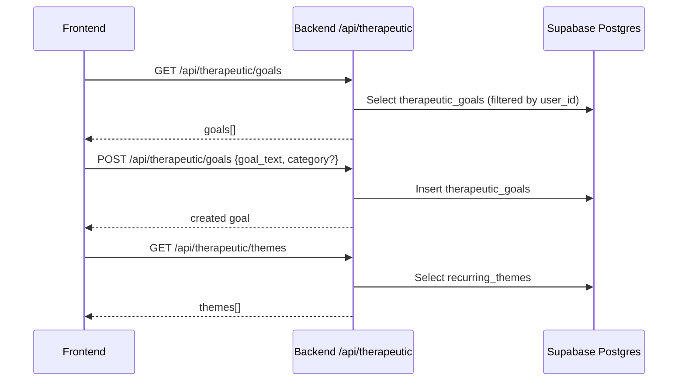

# Softspace (Cosmic Companion AI) — Features, Capabilities, and Data Flow

## Purpose
Softspace is a mental wellness companion built around:
- A supportive AI chat experience with safety checks and crisis detection
- Mood check-ins and trend visualization
- Guided journaling with AI-generated reflection/analysis
- Insights (patterns, themes, triggers) and gentle progress summaries
- Goals and growth plans that turn wellbeing intentions into small, manageable steps
- Coping tools (breathing, grounding, mindfulness)

This document describes what the system currently does (landing + app + backend), and how data flows through it.

---

## System at a glance

### Frontend
- React + Vite + TypeScript + Tailwind
- Supabase Auth on the client
- Stores the Supabase access token in `localStorage` as `supabase_token` for backend API calls
- Uses a small API client wrapper to call the FastAPI backend

### Backend
- FastAPI API server
- Supabase Postgres as the system database (via Supabase client)
- Uses both:
  - An anon Supabase client (respects RLS)
  - A service-role Supabase client (bypasses RLS), used carefully and always filtered by `user_id`
- AI orchestration in a single service module with:
  - Mistral (primary therapeutic chat)
  - Groq (emotion extraction, analysis, planning)
  - Gemini (fallback client initialized)

### Database
- Supabase Postgres + Supabase Auth (`auth.users`)
- Key tables: `user_profiles`, `chat_sessions`, `conversations`, `mood_logs`, `journals`, `tasks`, `growth_plans`, `plan_tasks`, `emotion_logs`, `context_cache`, `daily_insights`

---

## Landing site (marketing) contents

The landing experience is a set of public pages.

### Landing routes
- `/` — main landing page
- `/about` — about page
- `/privacy` — privacy landing page
- `/faq` — FAQ landing page
- `/privacy-policy` — app privacy policy page
- `/terms` — terms of service

### Main landing page sections
The main landing page is composed of:
- Navigation header
- Hero section (headline + CTAs)
- “Problem / We understand” section
- “How it helps” feature grid
- “See it in action” preview (phone mock with multiple screens)
- Final CTA section
- Footer

### “See it in action” preview
The landing preview shows four screens:
- Chat with Softspace (sample conversation text)
- Track your mood (example week chart + small summary cards)
- Guided journaling (example prompt + example reflection)
- Coping tools (breathing, grounding, meditation, “black hole”)

This preview is a marketing-only view; it is not connected to real user data.

---

## App (authenticated) contents

### Routing and access control
- Public auth pages: login, signup, forgot/reset password, verify email
- Protected route: `/app` (and `/app/*`) which renders the Dashboard experience

The app gates access by requiring:
- A Supabase-authenticated session
- Email verification (users are signed out if not verified)

### Core app views (inside the Dashboard)
The Dashboard switches between internal views:
- Home (summary widgets)
- Chat
- Tools
- Journal
- Plan
- Insights

### Home widgets (high-level)
The home view pulls a small set of analytics and renders widgets such as:
- Mood pulse / mood summary
- Recent session card(s)
- Active goals widget
- AI insight / daily insight widget
- Weekly digest widget
- Conversation stats widget
- Quick actions row

### Chat experience
- Session-based chats (like “ChatGPT/Claude style” sessions)
- Session list panel (load sessions, create new session, select session)
- Session reflection (generate a summary/reflection to save into journal)
- Crisis detection signal from the backend (UI can show a supportive modal)

### Mood tracking
- Users can log mood entries (score + optional triggers/notes)
- The app reads mood history and mood trend summary

### Guided journaling
- Users create entries with an optional prompt type
- Backend runs AI analysis and attaches supportive feedback
- Journals list view and single-entry retrieval
- Prompt suggestions endpoint provides a small curated prompt set

### Insights & history
- Insights combine mood, emotion logs, topics, triggers, and AI-generated summaries
- Timeline endpoint returns day-by-day trend items (mood/stress/energy/sentiment)

### Growth plans
- Users can request a growth plan for a focus area and a duration
- Backend generates a plan and tasks, stores them, and returns a plan + tasks payload

### Therapeutic goals (“memory”)
- A dedicated therapeutic memory service stores:
  - goals
  - recurring themes
  - pattern markers / interventions (where present)
  - emotional progress summaries

---

## Backend API surface

### Base server endpoints
- `GET /` — health-ish root
- `GET /health` — checks Supabase connectivity + rate limiter cleanup

### Auth model
- All protected endpoints require `Authorization: Bearer <supabase_access_token>`
- Backend validates the token using Supabase Auth.

### Routers and prefixes
- Chat: `/chat/*`
- Mood: `/mood/*`
- Journal: `/journal/*`
- Tasks: `/tasks/*`
- Insights: `/insights/*`
- Therapeutic memory: `/api/therapeutic/*`
- Account: `/api/account/*`

### Notable capabilities
- In-memory rate limiting middleware
  - Chat endpoints have a stricter quota than default endpoints
  - Auth/account endpoints have a stricter quota than default endpoints
- Uses service-role client (`supabase_admin`) where the anon client would be blocked by RLS
  - Important: all admin queries are still filtered by `user_id`

---

## Data model (conceptual)

### Key entities
- User (Supabase Auth): `auth.users`
- User profile: `user_profiles`
- Chat session: `chat_sessions`
- Conversation message/turns: `conversations`
- Mood check-in: `mood_logs`
- Journal entry: `journals`
- Emotion analytics events: `emotion_logs`
- Tasks: `tasks`
- Growth plan + tasks: `growth_plans`, `plan_tasks`
- Long-term context cache: `context_cache`
- Daily insight rollups: `daily_insights`

### Schema compatibility note
Some API code paths are designed to “gracefully degrade” if certain columns or tables don’t exist yet (for example `mood_logs.energy`, `journals.ai_feedback`, or session support). This allows the app to run across multiple schema versions, but it also means your exact database schema should match your migrations.

---

## End-to-end data flows

### 1) Authentication flow (frontend + Supabase)

Key storage:
- `localStorage.supabase_token` is used by the frontend API client.

### 2) Chat flow (session-based + AI + persistence)

What gets returned to the UI:
- `response` (assistant message)
- `session_id`
- `emotional_tone`, `mood_score`, `sentiment`, `detected_topics`
- `crisis_level` and `crisis_keywords` (when detected)
- possible `suggested_goal`

### 3) Mood logging flow

### 4) Journaling flow (AI analysis + persistence)

### 5) Insights flow (trends + AI-generated insight)

Timeline endpoint:
- `GET /insights/timeline` returns per-day items (mood, stress, energy, sentiment) computed using timezone-aware grouping.

### 6) Growth plan flow (Groq plan generation)

### 7) Therapeutic memory flow (goals + themes + progress)

---

## Safety and moderation (AI layer)

The AI service includes:
- Content safety pre-checks (blocks explicit NSFW/illegal requests before calling models)
- Crisis keyword detection (context-aware) to raise `crisis_level` signals to the UI
- Gentle, non-diagnostic language for progress/pattern summaries

---

## Configuration (environment variables)

### Backend (required)
The backend settings object requires these env vars:
- `SUPABASE_URL`
- `SUPABASE_KEY` (anon/public)
- `SUPABASE_SERVICE_ROLE_KEY`
- `GEMINI_API_KEY`
- `GROQ_API_KEY`
- `MISTRAL_API_KEY`

Optional backend env vars:
- `ENVIRONMENT` (development allows `*` CORS)
- `ALLOWED_ORIGINS` (comma-separated)
- `SOFTSPACE_DEBUG_LOGS` (set to `1` to re-enable verbose AI debug prints)

### Frontend (required for production)
- `VITE_SUPABASE_URL`
- `VITE_SUPABASE_ANON_KEY`
- `VITE_API_URL`

---

## Account management (privacy controls)

The backend supports:
- Account deletion: deletes the Supabase auth user
- Data export: exports JSON containing sessions/messages, journals, moods, tasks, plans, goals, emotion logs

---

## Operational notes

- The backend uses an in-memory rate limiter. For multi-instance deployments, this should be replaced with a shared store (e.g., Redis).
- The frontend stores an access token in `localStorage`. If you want stronger protection against XSS-style token theft, consider switching to httpOnly cookies and a BFF pattern.

---

## Source references (code paths)

Backend:
- Main API app: `backend/app/main.py`
- Auth validator: `backend/app/auth.py`
- Supabase clients: `backend/app/database.py`
- Chat routes: `backend/app/routes/chat.py`
- Mood routes: `backend/app/routes/mood.py`
- Journal routes: `backend/app/routes/journal.py`
- Tasks routes: `backend/app/routes/tasks.py`
- Insights routes: `backend/app/routes/insights.py`
- Therapeutic routes: `backend/app/routes/therapeutic.py`
- Account routes: `backend/app/routes/account.py`
- AI orchestration: `backend/app/services/ai_service.py`
- Therapeutic memory: `backend/app/services/therapeutic_memory.py`

Frontend:
- Router: `frontend/App.tsx`
- Auth state: `frontend/context/AuthContext.tsx`
- Supabase client: `frontend/utils/supabase.ts`
- API client: `frontend/utils/api.ts`
- Landing page composition: `frontend/landing/LandingPage.tsx`
- Landing feature grid: `frontend/landing/components/FeaturesSection.tsx`
- Landing preview: `frontend/landing/components/AppPreview.tsx`
- App shell: `frontend/pages/Dashboard.tsx`
